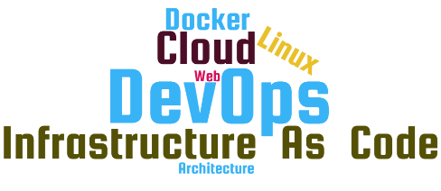

# Les infrastructures auto-adaptives  

<!-- .slide: class="page-title" -->

## @srevereault

- Sylvain Révéreault
- Directeur Technique @Zenika Rennes
- Consultant DevOps et Infrastructure as code

## Pourquoi s'adapter ?

## Pourquoi s'adapter ?

## Pourquoi s'adapter ?

