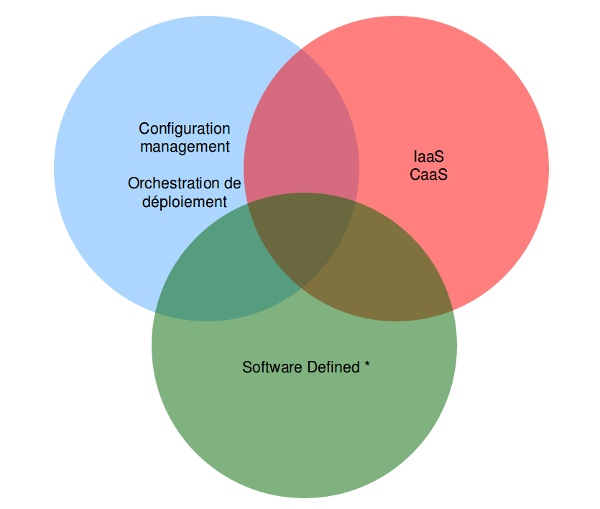

# Infra as code ?

<!-- .slide: class="page-title" -->


## Définition

<br/>
<br/>

<blockquote>Capacité à manipuler des infrastructures en utilisant des interfaces programmatiques.</blockquote>

<br/>

<p style="text-align: right">Sylvain Révéreault</p>


## Approches d'infra as code




## Configuration management


## Orchestration


## Virtualisation, IaaS, CaaS


## Virtualisation, IaaS, CaaS

```python
import boto
ec2 = boto.connect_ec2()
key_pair = ec2.create_key_pair('ec2-sample-key')  # only needs to be done once
key_pair.save('/Users/patrick/.ssh')
reservation = ec2.run_instances(image_id='ami-bb709dd2', key_name='ec2-sample-key')

# Wait a minute or two while it boots
for r in ec2.get_all_instances():
    if r.id == reservation.id:
        break
print r.instances[0].public_dns_name  # output: ec2-184-73-24-97.compute-1.amazonaws.com
```


## Software defined *


## Software defined networking


## Software defined networking


## Software defined networking

```bash
# Connection issues & priv password
expect {
timeout { send_user "\nTimeout Exceeded - Check Host\n"; exit 1 }
eof { send_user "\nSSH Connection To $hostname Failed\n"; exit 1 }
"*assword:" { send "$password\r" }
}

# Enable password
expect {
default { send_user "\nLogin Failed - Check Password\n"; exit 1 }
"*#" { send "\r" }
"*>" {
send "enable\n"
expect "*assword:"
send "$enablepassword\r"
}
}
```


## Software defined networking


## Software defined networking


## Software defined networking


