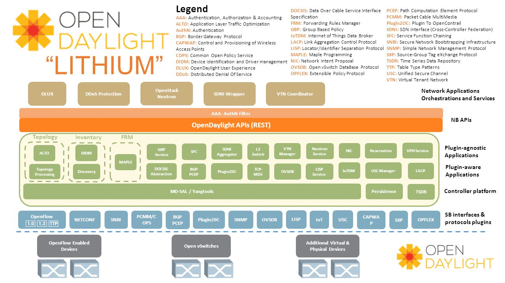

# Infra as code ?

<!-- .slide: class="page-title" -->


## Définition

TODO


## Approches d'infra as code

- Configuration management, orchestration de déploiement
- Virtualisation, IaaS, Containers
- Software defined \*


## Configuration management

- push/pull
- centralisé / décentralisé
- agent / agentless
- notion de "desired state configuration"
- notion d'idempotence


## Orchestration

- Orchestration de déploiement
  - d'applications
  - d'infrastructures
ex. : Terraform


## IaaS

Déploiement en quelques lignes de code :
 - de machines
 - de réseaux
 - de services d'infrastructure


## Software defined *

Au delà du bullshit : software defined networking


## Software defined networking


## Software defined networking


## Software defined networking

```bash
# Connection issues & priv password
expect {
timeout { send_user "\nTimeout Exceeded - Check Host\n"; exit 1 }
eof { send_user "\nSSH Connection To $hostname Failed\n"; exit 1 }
"*assword:" { send "$password\r" }
}

# Enable password
expect {
default { send_user "\nLogin Failed - Check Password\n"; exit 1 }
"*#" { send "\r" }
"*>" {
send "enable\n"
expect "*assword:"
send "$enablepassword\r"
}
}
```


## Software defined networking


## Software defined networking


## Software defined networking




<!-- .slide: class="page-demo" -->
