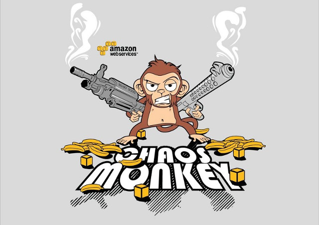
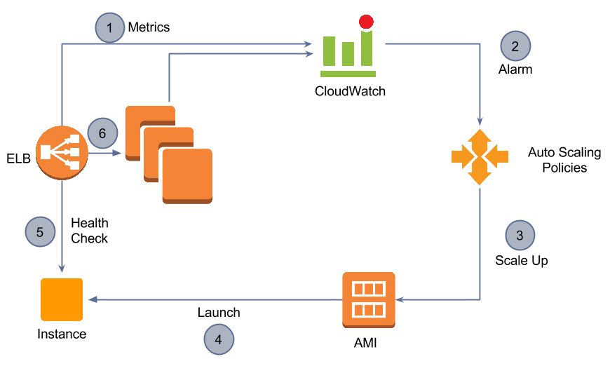
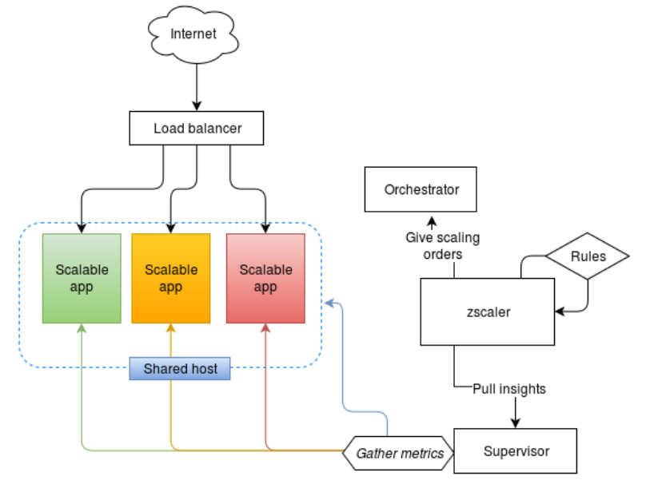
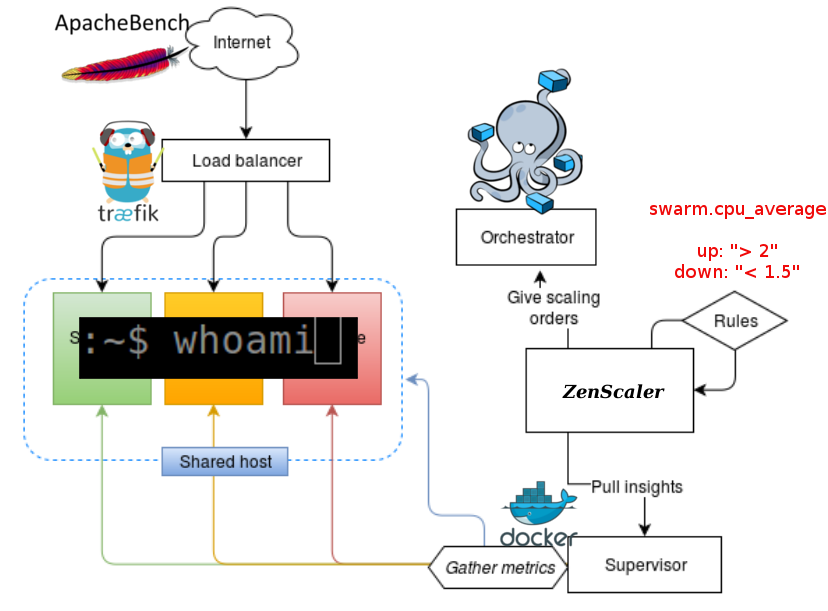
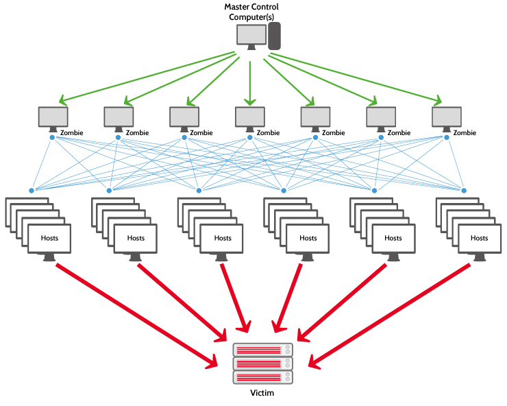
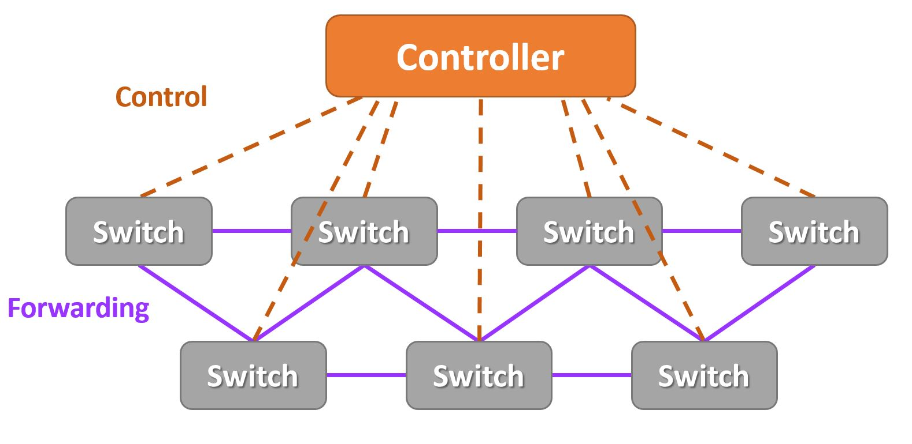
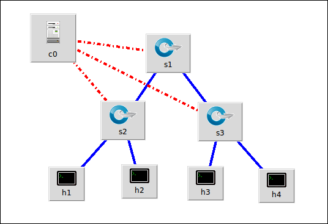
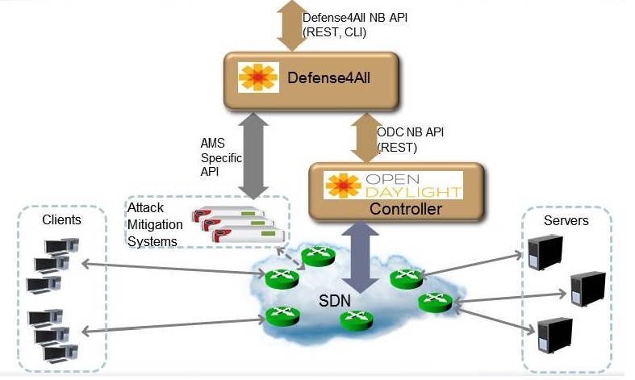

# S'adapter à quoi ?

<!-- .slide: class="page-title" -->

## Aux pannes

## Aux pannes : orchestrateurs

## Aux pannes : protocoles

[RAFT](https://raft.github.io/)

## Aux pannes : clustering

<iframe width="560" height="315" src="https://www.youtube.com/embed/fS9mB1Gvctw?list=PLsEeUqX8gm0N1Giw5Rsq09FmpZ5K4zsz2&start=710" frameborder="0" allowfullscreen></iframe>

## Aux pannes : testing

[Chaos Engineering](http://principlesofchaos.org/)

## A la charge

## A la charge : autoscaling

## A la charge : autoscaling

<!-- .slide: class="page-demo" -->

## A la charge : autoscaling

## Petite parenthèse :

[https://github.com/Zenika/zenscaler](https://github.com/Zenika/zenscaler)

## Aux malveillances

## Aux malveillances

## Aux malveillances : SDN Controller

<!-- .slide: class="page-demo" -->

## Aux malveillances : Démo

## Aux malveillances

