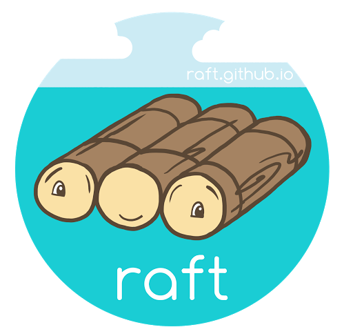
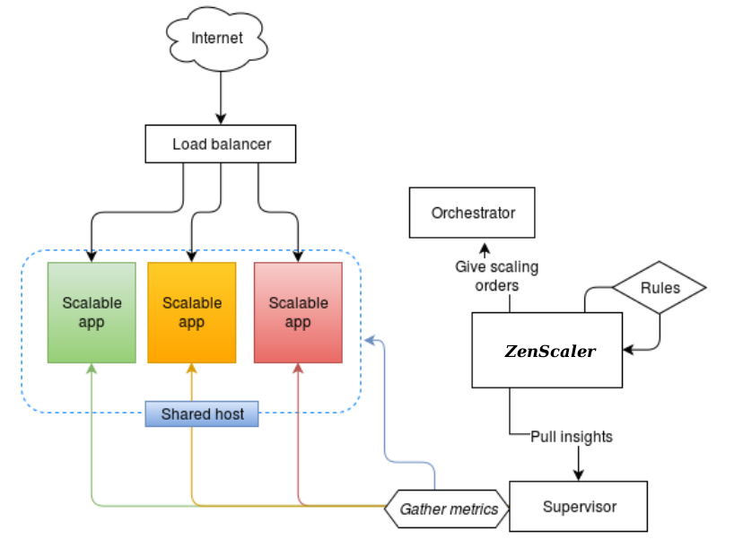
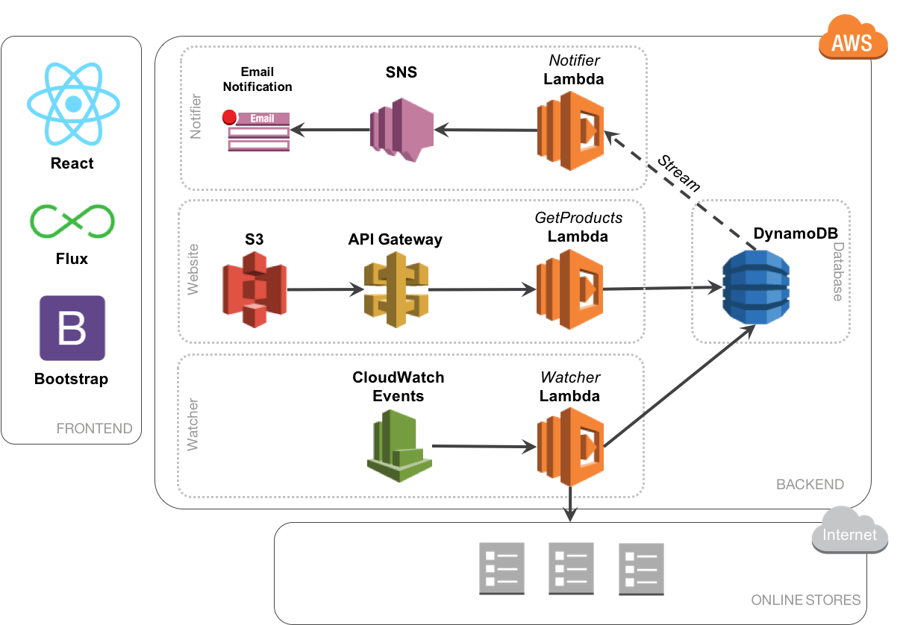
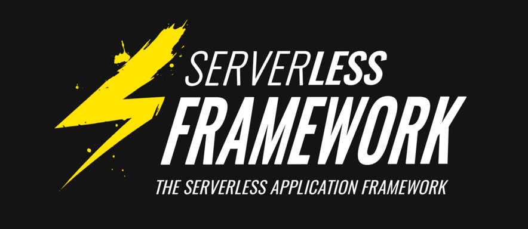

# S'adapter à quoi ?

<!-- .slide: class="page-title" -->


## Aux pannes


## Aux pannes : orchestrateurs


## Aux pannes : protocoles


[RAFT](https://raft.github.io/)


## Aux pannes : clustering

<iframe width="560" height="315" src="https://www.youtube.com/embed/fS9mB1Gvctw?list=PLsEeUqX8gm0N1Giw5Rsq09FmpZ5K4zsz2&start=710" frameborder="0" allowfullscreen></iframe>


## Aux pannes : testing


## A la charge


## A la charge : autoscaling


## A la charge : autoscaling




<!-- .slide: class="page-demo" -->


## Parenthèse : serverless




## Parenthèse : serverless

```java
package example;

import com.amazonaws.services.lambda.runtime.Context;
import com.amazonaws.services.lambda.runtime.RequestHandler;

public class Hello implements RequestHandler<String, String> {
    @Override
    public String handleRequest(String input, Context context) {
    	String output = "Hello, " + input + "!";
    	return output;
    }
}
```


## Parenthèse : serverless




## Aux malveillances


## Aux malveillances


## Aux malveillances : SDN Controller


<!-- .slide: class="page-demo" -->


## Aux malveillances : Démo


## Aux malveillances


