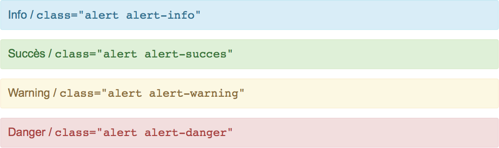
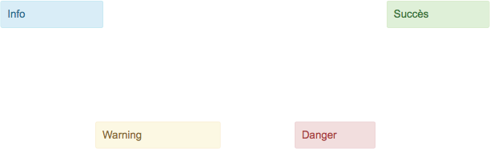

# Syntaxe avancée

<!-- .slide: class="page-title" -->


## Sommaire

<!-- .slide: class="toc" -->

- [Syntaxe de base](#/1)
- [Code et tableaux](#/2)
- [Positionnement des images](#/3)
- [Animations](#/4)
- **[Syntaxe avancée](#/5)**


## Alertes
Un bloc alert s'écrit : ```<!-- .element class="alert alert-info"-->```


<!-- .element class="alert alert-info"-->
Info / `class="alert alert-info"`

<!-- .element class="alert alert-success"-->
Succès / `class="alert alert-succes"`

<!-- .element class="alert alert-warning"-->
Warning / `class="alert alert-warning"`

<!-- .element class="alert alert-danger"-->
Danger / `class="alert alert-danger"`


Rendu :

<figure>
    
</figure>


## Alertes avec positionnement absolu

<!-- .element class="alert alert-info" style="position: absolute; top: 125px; left: 10px; width: 200px;"-->
Info

<!-- .element class="alert alert-success" style="position: absolute; top: 125px; right: 10px; width: 200px;"-->
Succès

<!-- .element class="alert alert-warning" style="position: absolute; top: 40%; left: 20%; width: 250px;"-->
Warning

<!-- .element class="alert alert-danger" style="position: absolute; top: 40%; left: 60%; width: 150px;"-->
Danger

<br><br><br><br><br><br><br><br><br>
Rendu :
<figure>
    
</figure>


## Ajouter du HTML

Il est possible d'inclure directement du code HTML dans le markdown.

<div style="background-color: black; color: white; padding: 5px 20px" class="code">
  &gt; git commit -m "init"<br>
</div>

<br>

Avec le code HTML :
```xml
<div
    class="code"  
    style="background-color:
        black; color: white;
        padding: 5px 20px">
  &gt; git commit -m "init"<br>
</div>
```


<!-- .slide: class="page-questions" -->


<!-- .slide: class="page-tp5" -->
